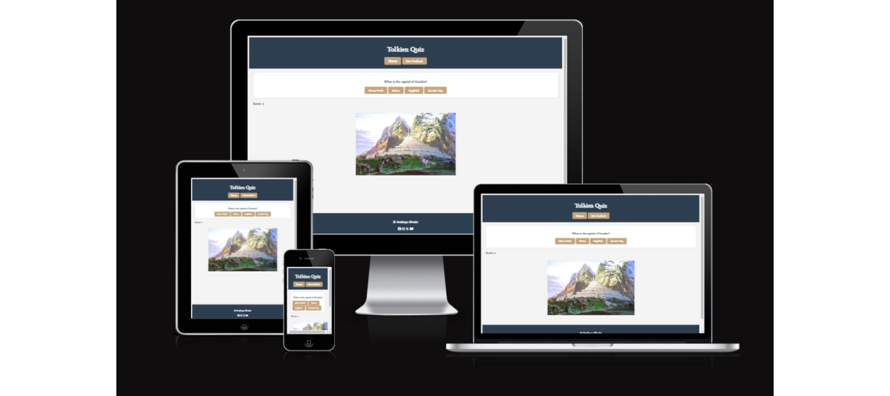
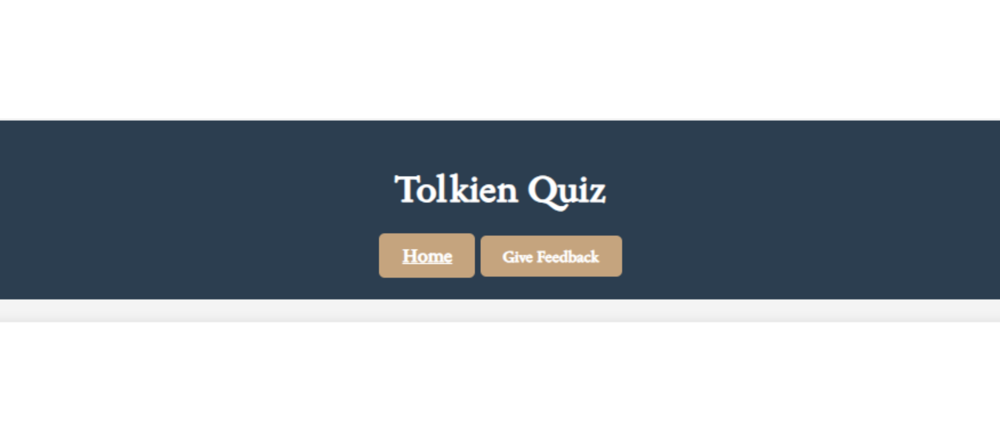
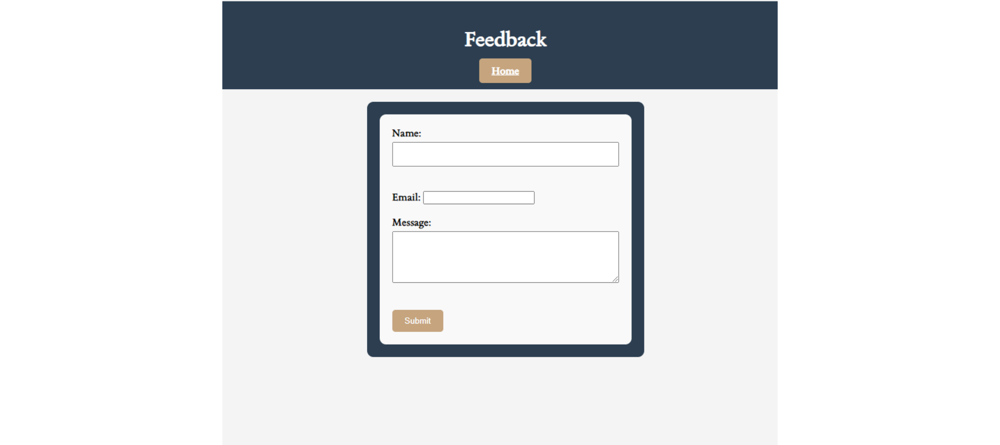
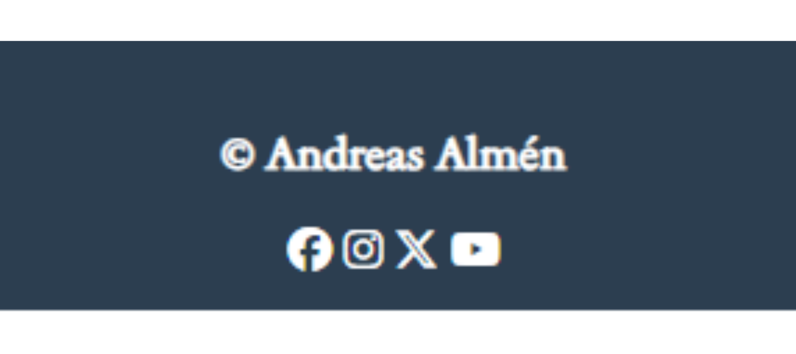

# Tolkien Quiz

[Tolkien Quiz](https://pumpkinpoem.github.io/Tolkien-Quizz/) is a description of your project. Add a brief overview here to introduce what your project is about.

## Description

Welcome to Tolkien Quiz, the ultimate trivia experience for fans of J.R.R. Tolkien's iconic works! Dive into Middle-earth and test your knowledge of characters, places, and events from The Lord of the Rings, The Hobbit, and beyond. Whether you're a seasoned loremaster or a newcomer to Tolkien's fantastical universe, this quiz promises fun, excitement, and maybe even a few surprises along the way.

## Existing Features

- **Navigation Bar:**
  - Featured on all pages, the fully responsive navigation bar includes links to the Home page and Feedback page. It is consistent across all pages to ensure easy navigation.
  - This section enables users to navigate seamlessly across all devices without needing to rely on the back button.

- **Feedback:**
  - Allows users to sign up for One Dice's email list and choose a welcome gift from two options of dice sets.

- **Footer:**
  - The footer section includes links to One Dice's social media profiles, allowing users to connect with the cafe on various platforms.

## Visual Features

- **Engaging Trivia Questions**: Challenge yourself with a diverse range of questions covering various aspects of Tolkien's literary world.
- **Beautiful Design**: Immerse yourself in the enchanting atmosphere of Middle-earth with a visually appealing and user-friendly interface.
- **Responsive Layout**: Enjoy seamless quiz-taking on any device, from desktops to mobile phones.
- **Score Tracking**: Keep track of your progress and see how well you fare against other quiz-takers.
- **Fun Facts**: Learn interesting tidbits and trivia about Tolkien's creations with each question.

## Usage

1. Visit the Tolkien Quiz website.
2. Start the quiz and answer each question to the best of your ability.
3. Receive instant feedback on your answers and learn fascinating facts about Tolkien's universe.
4. Complete the quiz and compare your score with friends and fellow Tolkien enthusiasts.

## Colors

The colors chosen for Tolkien Quiz are inspired by the rich and vibrant imagery found throughout J.R.R. Tolkien's works:

- **Forest Green**: Evoking the lush landscapes of Middle-earth's forests and meadows.
- **Golden Yellow**: Representing the warmth of friendship, the light of hope, and the allure of adventure.
- **Light Blue**: Reflecting the vivid nature of Tolkien's storytelling and the connection to the natural world.

## Features Left to Implement

- more questions and fun facts.

## Testing 

Describe the testing process for your project here. Include sections such as functional testing, Lighthouse testing, validator testing, and any unresolved bugs.

### Functional Testing

| Action                                             | Expected Behavior                                                | Pass/Fail |
|----------------------------------------------------|------------------------------------------------------------------|-----------|
| Selecting an answer option                         | The selected option is highlighted, and feedback is displayed.    |    pass       |
| Clicking "Next" button after answering             | Moves to the next question in the quiz sequence.                 |       pass    |
| Answering the last question and clicking "Next"    | Completes the quiz and displays the final score.                 |       pass    |
| Clicking "Give Feedback" button                    | Opens a feedback form in a new window or modal.                  |       pass    |
| Submitting feedback form                           | Feedback is submitted successfully, and a confirmation message is displayed. |      pass     |
| Clicking "Back" or "Home" button in the header               | Navigates back to the home page.                                 |     pass      |
| Clicking social media icons in the footer          | Opens corresponding social media profiles in new tabs.           |       pass    |
| Resizing the browser window                        | Ensures the quiz layout remains responsive and maintains usability. |    pass       |
| Completing the quiz without selecting any answers  | Prevents progression and prompts the user to select an answer.   |      pass     |
| Refreshing the page during the quiz               | Restarts the quiz from the beginning.                            |       pass    |
| Clicking on an answer option                       | Highlights the selected option and deselects others.              |        pass   |
| Attempting to move to the next question without selecting an answer | Prompts the user to select an answer before proceeding.   |      fail     |
| Clicking "Give Feedback" button without answering any questions | Displays a message informing the user to complete the quiz first. |     pass      |
| Entering invalid data in the feedback form         | Displays error messages and prevents form submission.           |     pass      |
| Hovering over the quiz options                     | Provides visual feedback such as changing color or displaying tooltips. |      pass     |
| Pressing keyboard shortcuts for navigation         | Ensures keyboard navigation is accessible and functional.      |      not implimented     |
| Attempting to access the quiz page directly from a URL | Redirects to the home page to prevent unauthorized access.   |      pass     |

### Lighthouse Testing

Include screenshots or summaries of Lighthouse test results for your project.

### Validator Testing

- HTML: index
  - No errors were found when passing through the official W3C validator.
 - https://validator.w3.org/nu/?doc=https%3A%2F%2Fpumpkinpoem.github.io%2FTolkien-Quizz%2F
 - https://validator.w3.org/nu/?doc=https%3A%2F%2Fpumpkinpoem.github.io%2FTolkien-Quizz%2Ffeedback.html
 - https://validator.w3.org/nu/?doc=https%3A%2F%2Fpumpkinpoem.github.io%2FTolkien-Quizz%2Fthankyou.html

- CSS:
  - No errors were found when passing through the official Jigsaw validator.

### Unresolved Bugs

Describe any unresolved bugs in your project.

## Deployment

This project is deployed on GitHub Pages. You can access the live deployment [here](https://pumpkinpoem.github.io/Tolkien-Quizz/).

To deploy your project on GitHub Pages:
1. Create a GitHub repository for your project.
2. Push your code to the repository.
3. Configure GitHub Pages in the repository settings.
4. Verify the deployment by visiting the provided URL.
5. Update your deployment by pushing new changes to GitHub.
6. Share the deployment link with others to access your project online.

## Credits 

- Code cleanup and adjustments were done with assistance from ChatGPT.
- Spelling and grammar fixes were done with ChatGPT.
- Huge thank you to Alexandra, Fredrik and Lana

### Content 

- Icons sourced from [Font Awesome](https://fontawesome.com/).
- Fonts used: sedan Serif and Libre Baskerville from [Google Fonts](https://fonts.google.com).

### Media

- Home and sign-up page photos and videos where taken from google
- Favicons obtained from [Favicons.io](https://favicon.io/emoji-favicons/green-book).